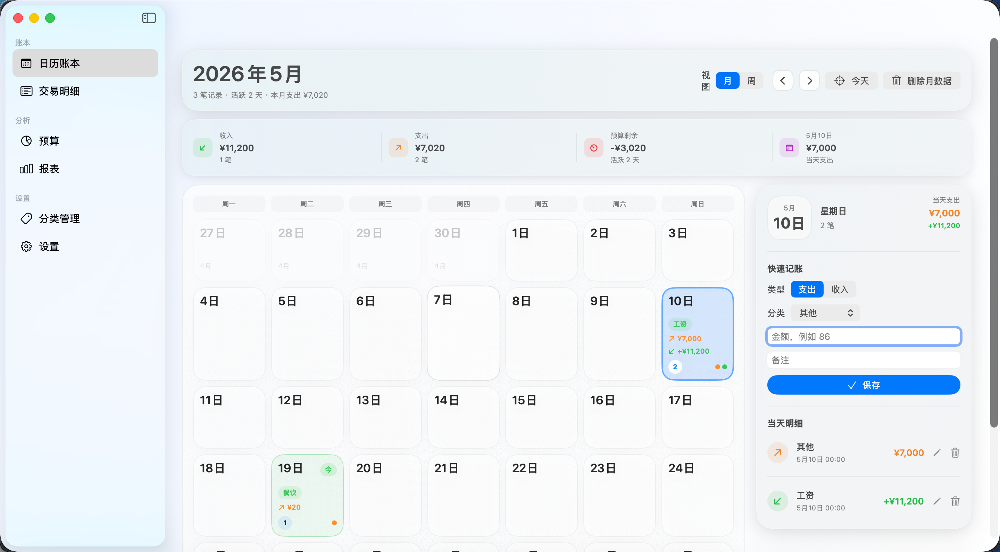

# CustomMoneyManager

*A TallyBook APP*

A native macOS personal finance app built with SwiftUI. Track income and expenses with a calendar-based ledger, manage monthly and category budgets, and visualize your spending with interactive charts.

<p align="center">
  
</p>

## Features

- **Calendar Ledger** — Month and week views with daily entry cards showing income, expense, and top spending category at a glance.
- **Quick Entry** — Add, edit, and delete entries inline from the day panel. Supports income/expense types, customizable categories, and free-text notes.
- **Transactions** — Scrollable list of all entries with search across categories and notes.
- **Budgets** — Monthly total budget with animated progress bar. Per-category budgets let you track spending at a granular level.
- **Reports** — Bar chart for monthly income vs. expense trends (3/6/12 months). Donut chart for this month's expense breakdown by category.
- **Category Management** — Add and remove custom categories for both income and expense. Deleted categories reassign entries to "Other".
- **Data Management** — Delete data by month/week or clear all entries while preserving settings.
- **Bilingual** — Full Chinese and English localization, switchable in Settings.
- **Glassmorphism UI** — Native SwiftUI design with `.ultraThinMaterial` panels, smooth animations, and responsive layouts.

## Requirements

- macOS 14 (Sonoma) or later
- Xcode 16+

## Install

Clone the repository, then open the Xcode project:

```sh
git clone https://github.com/your-username/CustomMoneyManager.git
cd CustomMoneyManager
open CustomMoneyManager/CustomMoneyManager.xcodeproj
```

Build and run with **Product > Run** (⌘R).

## Tech Stack

- **SwiftUI** — Declarative UI framework
- **Charts** — Swift Charts for bar and donut charts
- **Combine** — Reactive state management via `@Published` / `ObservableObject`
- **Codable + JSON** — Local persistence to `Application Support`

## License

MIT — see [LICENSE](LICENSE).
